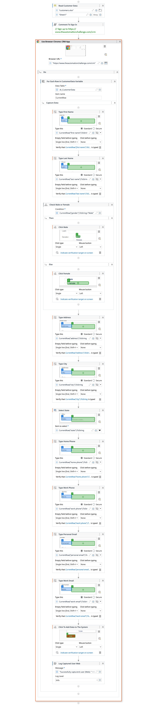

# 🤖 Data Capturing Robot

## 📌 Overview
The **Data Capturing Robot** is an end-to-end UiPath automation designed to capture customer data and enter it into **both a Web CRM application and a Desktop application simultaneously**.

The robot reads structured customer data from an Excel file and automates form filling, selection, and submission across two different platforms, ensuring **speed, accuracy, and consistency**.

This project demonstrates **parallel execution**, **data-driven automation**, and **enterprise-grade UI automation**.

---

## 🎯 Objectives
The primary objectives of this automation are to:

- Read customer records from an Excel data source
- Capture customer details automatically
- Enter data into a **Web CRM application**
- Enter the same data into a **Desktop application**
- Run web and desktop workflows **simultaneously**
- Log successful data capture for monitoring and auditing

---

## 🌟 Key Features

- **Excel-Driven Automation** – Reads multiple customer records from an Excel sheet
- **Parallel Execution** – Web and Desktop workflows run at the same time
- **Web Automation** – Automatically fills customer forms in a CRM web application
- **Desktop Automation** – Inputs customer data into a desktop application
- **Conditional Logic** – Handles gender selection, state selection, and form controls dynamically
- **High Accuracy** – Ensures validated and reliable data entry
- **Logging** – Logs completion and success messages for both workflows

---

## ⚙️ Technologies Used

- UiPath Studio
- UiPath UIAutomation Activities
- UiPath Excel Activities
- Google Chrome (for web automation)
- Desktop UI Automation

---

## 🧪 Prerequisites

- UiPath Studio installed on your machine
- Google Chrome browser
- Target Desktop Application installed
- Microsoft Excel
- Stable internet connection

---

## 🛠️ Setup Instructions

1. Clone or download this repository
2. Open the **Data Capturing Robot** project in UiPath Studio
3. Ensure the following packages are installed:
   - `UiPath.UIAutomation.Activities`
   - `UiPath.Excel.Activities`
4. Update configuration values if required:
   - Excel file path
   - Web CRM URL
   - Desktop application path
5. Validate selectors for your environment
6. Click **Run** in UiPath Studio

---

## 🔎 Workflow Breakdown

### 1️⃣ Main Controller Workflow
- Acts as the orchestrator for the automation
- Executes **WebDataCapturing.xaml** and **DesktopDataCapturing.xaml** in parallel
- Logs completion messages after both workflows finish

---

### 2️⃣ Read Customer Data
- Reads customer data from an Excel sheet into a collection
- Fields captured include:
  - First Name
  - Last Name
  - Gender
  - Address
  - City
  - State
  - Home Phone
  - Work Phone
  - Personal Email
  - Work Email

---

### 3️⃣ Web Data Capturing Workflow
- Opens the CRM web application in Google Chrome
- Iterates through each customer record
- Performs the following actions:
  - Types text into input fields
  - Selects gender radio buttons
  - Selects state from dropdown
  - Submits the form
- Logs successful data capture

---

### 4️⃣ Desktop Data Capturing Workflow
- Launches the desktop application
- Iterates through the customer dataset
- Performs:
  - Text entry into UI fields
  - Radio button selection
  - Save actions
- Assigns incremental customer numbers dynamically
- Logs successful data capture

---

## 🖼️ Workflow Screenshots

### 🔹 Main Sequence

### 🔹 Web Data Capturing

### 🔹 Desktop Data Capturing

---

## 📝 Sample Log Output

- Web Data Capturing Completed
- Desktop Data Capturing Completed
- Successfully captured customer details
- Customer record processed successfully

---

## 🚀 Use Cases

- CRM data entry automation
- Customer data migration
- Parallel system updates
- Manual data entry reduction
- Improved processing speed and accuracy

---

## 🧠 Learning Outcomes

- Parallel workflow execution in UiPath
- Data-driven automation using Excel
- Web and Desktop automation integration
- Dynamic UI element handling
- Scalable enterprise automation design

---

🤖📊 *"One Excel file. Two platforms. Zero manual effort."*

